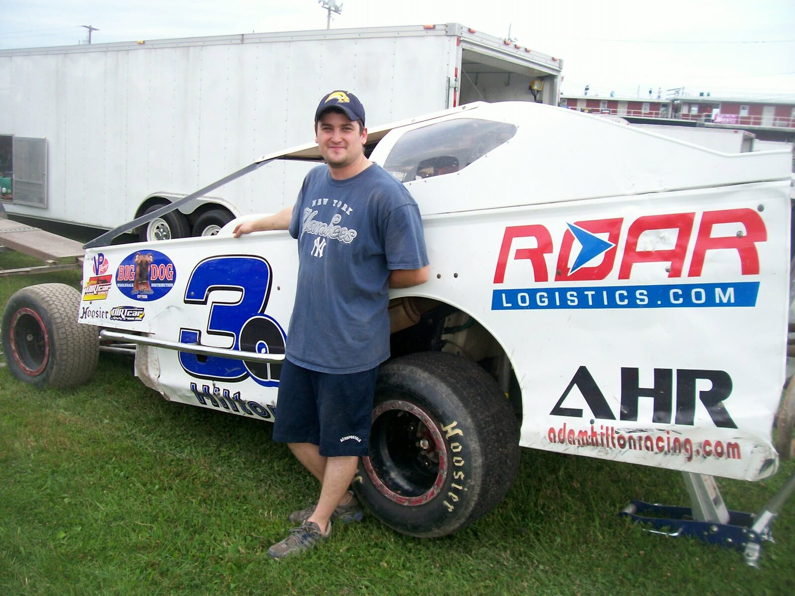

# Adam Hilton Racing — setup notes

## 1. Add your photos
Open `index.html` and search for `photo-slot` — there's one placeholder right now, in the About section.
Once you send me your logo and photos, I'll drop them in and swap the placeholder boxes for real `` tags. If you want to do it yourself: replace the whole `<div class="photo-slot">...</div>` block with something like:
```html

```
and put the image file in an `images` folder next to `index.html`.

## 2. Turn on the contact form
The form currently points at a placeholder Formspree URL. To make it live:
1. Go to formspree.io and create a free account (no credit card needed — free plan covers 50 submissions/month, plenty for a site like this).
2. Create a new form, connect it to the email you want inquiries sent to.
3. Copy the form endpoint it gives you (looks like `https://formspree.io/f/abc123xy`).
4. In `index.html`, find `action="https://formspree.io/f/YOUR_FORM_ID"` and replace `YOUR_FORM_ID` with yours.
5. Also update the `mailto:info@adamhiltonracing.com` link near the form to whatever email address you actually want to use.

## 3. Put the site online (free hosting)
Recommended: **GitHub Pages**. It's free, and — importantly — it doesn't require moving your domain's nameservers, so your existing email setup won't be touched. See the deployment walkthrough in chat for the exact steps.

## 4. Point your domain at it
Also covered in the chat walkthrough — you'll add a few DNS records at wherever you currently manage adamhiltonracing.com's DNS, without disturbing the MX records your email depends on.
